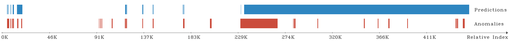

# Enhanced Time-series Aware Precision and Recall

An anomaly coincides with a 'time range' in time-series data because an anomalous event (e.g., cyber attack, failure, or fraud) affects a system in a period. 
The data in this period would have the same pattern.
However, most conventional accuracy metrics overlook this point of view mentioned above.
For this reason, we propose a novel metric, TaPR.
* TaPR paper: https://doi.org/10.1145/3357384.3358118
* TaPR git: https://github.com/saurf4ng/TaPR

However, our TaPR has the problem of overrating inaccurate evaluation cases.
Remark that existing metrics(ref1, ref2, ref3) also suffer from this problem.
For this reason, the existing metrics, including TaPR overrate a detection method.
So, I improve TaPR and propose 'enhanced Time-series aware Precision and Recall (eTaPR).'
You can find the details of problem and eTaPR in the paper to be announced at ACM SAC '22. (I'll give you a link to my paper.)

This repository includes:  
(1) Source codes in the directory, 'eTaPR_pkg'  
(2) A wheel package: eTaPR-21.12.1-py3-none-any.whl  
(3) Sample data in the directory, 'Sample_Data'  
(4) Example jupyter code in the file, 'test_comparison.ipynb'


My script is developed on Python3.8.3.  
You need the following packages: numpy, pandas, math, argparse, time, datetime, pathlib, copy, and open-cv.


## Install with a wheel file

I provide a wheel file to install our 'eTaPR' package.
It is better to install it with a wheel file because python would be confusing the file path in our package.


## Inputs

As input, our metric gets two files (encoded by UTF-8) or two python lists.
Suppose that two files are given, one file represents anomalies (i.e., a ground truth), and the other is prediction results provided by an anomaly detection method.

Two files (or lists) always contain the identical type that our package can handle.
There are two kinds of type: STREAM or RANGE.

1. STREAM

In a file, each line consists of [(label)('\n')] as belows:

```
1
-1
-1
1
1
```
Assume that normal and anomaly labels are '1' and '-1', respectively.
Similarly, a python list contains series of integers (1 or -1).


2. RANGE

In a file, each line consists of [(first_index),(last_index),(attack_name)('\n')] as belows:

```
1754,2800,1
3080,3690,2
5299,5400,3
```
The index indicates the number of a row in the test dataset.

To append a range in a python list, we provide the 'Range' class that store a range (i.e., match with a row in above example).
You can use the 'Range' class by importing a package and make a list of Ranges as belows:
```
from eTaPR_pkg.DataManage import Range

anomalies = [   Range.Range(1754, 2800, '1'), 
		Range.Range(3080, 3690, '2'), 
		Range.Range(5299, 5400, '3')  ]
```


## Execution

My metric can be executed in the command-line interface; moreover, it is possible to use it with a function call.
The command-line interface only deals with 'files'; whereas, the functions use both 'files' and 'python lists.'


### Command-Line Interface

python -m eTaPR_pkg.etapr --anomalies <anomaly_file> --predictions <prediction_file> --filetype <input_file_type> {--theta_p} <theta_p> {--theta_r} <theta_r> {--delta} <delta> {--verbose} {--graph} <graph>

Here is a description of all command line options, inputs, and parameters:

```
--anomalies:	File with anomalies (i.e., ground truth)
--predictions:	File with predictions
--filetype:		Notify type of the input files is whether 'stream' or 'range'
				The other types occurs error
--theta_p:		Parameter theta for eTaP 
				Set as float value from 0 to 1
				Default = 0.5
--theta_r:		Parameter theta for TaR 
				Set as float value from 0 to 1
				Default = 0.1
--delta:		Parameter delta for subsequent scoring
				Set as float value from 0 to 1
				Defualt = 0.0
--verbose:		Enable printing the list of detected anomalies and correct predictions
				No need input values 
--graph:		Determine how to show the brief plot chart whether saving on a file named 'brief_result.png' or showing on the screen
				There are 4 available options: 'all', 'file', 'screen', and 'none'.
				Default = none
```

If you need to see help menue, please type below operation:

```
python -m eTaPR_pkg.eTaPR -h

or

python -m eTaPR_pkg.eTaPR --help
```


#### Examples

Below two examples produce indentical results.

```
python -m eTaPR_pkg.eTaPR --predictions ocsvm.csv --anomalies swat_attack.csv --filetype range --theta_p 0.1 --theta_r 0.01 --delta 0.1 -- graph all --verbose
```

```
python -m eTaPR_pkg.eTaPR --predictions ocsvm.csv --anomalies swat_attack.csv --filetype stream
```


### Function Call

There are several functions you can use in our package.
To use this function, you import our package as belows:
```
from eTaPR_pkg import etapr
```

There are two functions: 'evaluate_w_ranges()' and 'evaluate_w_streams()' that consider python lists as their input.
Their prototypes are as belows:

```
evaluate_w_ranges(anomalies: list, predictions: list, theta_p: float, theta_r: float, delta: float = 0.0) -> dict:
evaluate_w_streams(anomalies: list, predictions: list, theta_p: float, theta_r: float, delta: float = 0.0) -> dict:
``` 

The only difference between two functions is that their input lists contains 'stream' or 'range' type.

They return a dictionary stored information as belows:
|Key|Description|
|-----|-----------|
|eTaR|An eTaR score|
|eTaRd|An detection score for eTaR|
|eTaRp|An portion score for eTaR|
|eTaP|An eTaP score|
|eTaPd|An detection score for eTaP|
|eTaPp|An portion score for eTaP|
|Detected_Anomalies|A python list contianing Ranges of detected anomalies|
|Correct_Predictions|A python list contianing Ranges of correct predictions|
|f1|A F1 score of eTaR and eTaP scores|
|False Alarm|A total length of false alarms (incorrect predictions)|
|N False Alarm|The number of false alarms|


In addition, these functions provide other scores proposed by related work.
The 'Precision' and 'Recall' are one of the most popular accuracy metrics.
You can see their details in a [WIKI page](https://en.wikipedia.org/wiki/Precision_and_recall).
The point-adjust ones are getting popular recently, which proposed in the [paper](https://dl.acm.org/doi/abs/10.1145/3178876.3185996) published in WWW'18.

|Key|Description|
|-----|-----------|
|precision|A conventional precision score|
|recall|A conventional recall score|
|point_adjust_precision|A point-adjust precision score|
|point_adjust_recall|A point-adjust recall score|


One of our function, evaluate_w_files(), get files as input, and its prototype is as belows:
```
def evaluate_w_files(anomaly_file: str, prediction_file: str, file_type: str, theta_p: float, theta_r: float, delta: float = 0.0) -> dict:
```

To visualize the predictions and anomalies, you can utilize the function, 'draw_graph().' whose prototype as belows:
```
def draw_graph(anomalies: list, predictions: list, graph_dst: str) -> None:
```
Its result is shown as belows:
	



#### Example

I present an example how to call a function.
```
from eTaPR_pkg import etapr
from eTaPR_pkg.DataManage import Range

method1 = [ Range.Range(2, 57, ''), Range.Range(59, 60, ''), Range.Range(62, 64, ''), Range.Range(66, 69, '') ]
method2 = [ Range.Range(2, 17, ''), Range.Range(59, 60, ''), Range.Range(62, 64, ''), Range.Range(66, 69, '') ]
anomalies = [ Range.Range(1, 4, ''), Range.Range(59, 60, ''), Range.Range(62, 64, ''), Range.Range(67, 96, '') ]

theta_p = 0.5
theta_r = 0.01
delta = 0

result1 = 'eTaP'
result2 = 'eTaR'

result = etapr.evaluate_w_ranges(anomalies, method1, theta_p=theta_p, theta_r=theta_r, delta=delta)
print(result[result1], result[result2])

result = etapr.evaluate_w_ranges(anomalies, method2, theta_p=theta_p, theta_r=theta_r, delta=delta)
print(result[result1], result[result2])

```

The result of above script is as belows:
```
0.3876823062996395 0.6375
0.535329416677799 0.6375
```

